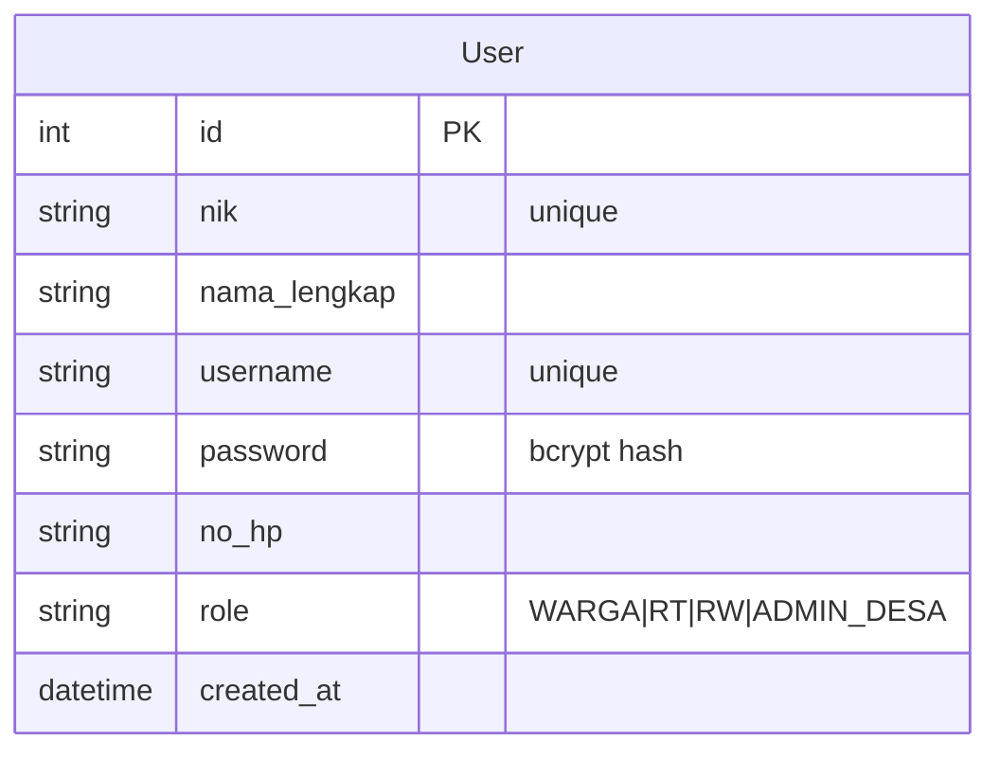
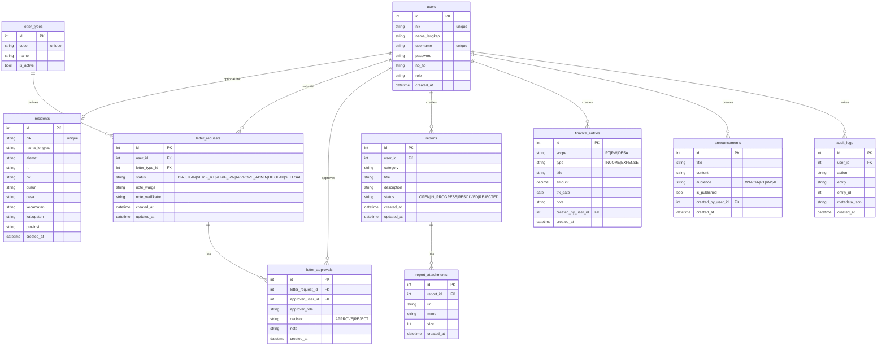

# ERD — Entity Relationship Diagram (DigiDesa)

Dokumen ini memuat ERD **current (sudah ada)** dan **target (rencana)**.

> Catatan: bagian **Target (Rencana)** adalah proposal desain agar mudah dikembangkan sesuai halaman yang sudah ada di frontend. Ini belum semua terimplementasi di backend.

---

## A) Current (Sudah ada di backend)

### Entity: `User`

---

## B) Target (Rencana keseluruhan)

Tujuan rancangan:
- Memisahkan “akun login” (`users`) dari data kependudukan (`residents`) bila dibutuhkan.
- Menyediakan workflow surat (approval RT/RW/Admin) dan pelacakan status.
- Mendukung modul laporan warga, keuangan, pengumuman, dan audit.

### Catatan desain

- `users` sudah ada (implemented). Tabel lain adalah target implementasi.
- Untuk produksi:
  - Tambahkan index pada kolom FK (`user_id`, `letter_type_id`, dst.).
  - Pertimbangkan soft delete untuk entitas penting.
  - Pertimbangkan normalisasi wilayah (master RT/RW) bila skala besar.
